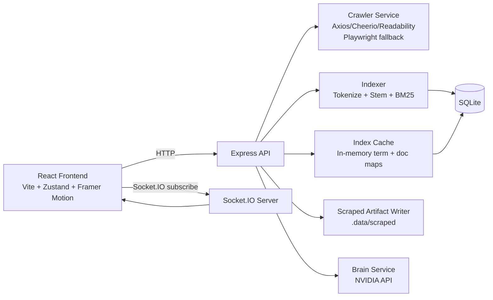

# TSE - Tiny Search Engine

<p align="center">
  Crawl the web, index content, and search it in real time with a modern developer-first interface.
</p>

<p align="center">
  
  
  
  
  
  
</p>

## Why TSE

TSE is a full-stack search platform that lets you:

- Crawl and ingest pages from a target site
- Build a local ranked index using BM25-style weighting
- Run low-latency keyword search with advanced query operators
- Surface search analytics and content gaps
- Explore saved crawl artifacts (raw HTML, extracted text, metadata, structured JSON)
- Optionally synthesize top results into a natural-language answer with an AI Brain mode

This project is designed to feel like a mini search engine lab: practical enough to use, and deep enough to demonstrate real information-retrieval engineering.

## System Highlights

- Monorepo architecture with shared types across frontend and backend
- Real-time crawl telemetry pushed over Socket.IO
- Multi-strategy extraction pipeline:
  - Fast path: Axios + Cheerio + Readability
  - Resilient path: Playwright (with stealth plugin) when sites block simple HTTP clients
- Query understanding with support for:
  - Quoted exact phrases, for example "quantum tunneling"
  - Exclusions, for example -ads
  - Site filter, for example site:example.com
- Persistent search analytics with zero-result detection to guide crawling strategy
- Modern UI with motion, live crawl progress, analytics dashboards, and scraped-file explorer

## Architecture



## Monorepo Layout

```text
TSE/
|- frontend/          React app (search, crawl, analytics, explorer)
|- backend/           Express API, crawler, indexer, storage, sockets
|- shared/            Shared TypeScript contracts
|- package.json       Workspace scripts and orchestration
```

## Core Features

### 1) Crawl and Index Pipeline

- Endpoint: POST /crawl
- Input: URL, depth (1 to 3), optional browser flag
- Process:
  1. Validates input with Zod
  2. Crawls target pages with politeness and anti-bot fallback strategy
  3. Classifies page as Product, Article, Listing, or General
  4. Extracts clean text and structured payload
  5. Indexes document into SQLite + in-memory cache
  6. Emits live progress events to clients
  7. Writes crawl artifacts into deterministic folder tree

### 2) Ranked Search

- Endpoint: GET /search
- Ranking model: BM25-like scoring over stemmed tokens
- Supports query operators:
  - Exact phrases with quotes
  - Negative terms with leading minus
  - Domain filter with site:
- Returns:
  - Paginated ranked hits
  - Latency measurements
  - Spelling suggestion (Levenshtein-based) when confidence is good

### 3) Meaningful (AI Brain) Mode

- In meaningful mode, top documents are sent to Brain for synthesis
- Brain uses an NVIDIA-compatible chat-completions API
- Useful for summarizing intent from top ranked results
- Gracefully degrades when API key is not configured

### 4) Analytics and Gap Discovery

- Endpoint: GET /analytics
  - Most frequent queries
  - Average latency by query
- Endpoint: GET /analytics/gaps
  - Queries that produced zero results
- Purpose: closes the loop between what users ask and what your index still lacks

### 5) Scraped Explorer

- Endpoints:
  - GET /api/scraped/tree
  - GET /api/scraped/file?path=...
- Browse crawl output as a filesystem tree
- Includes path traversal protections for safe file reads

## Frontend Experience

The React client provides three primary views:

- Search
  - Keyword search
  - Meaningful mode toggle
  - Typeahead suggestions
  - Live crawl progress panel with ETA and extraction terms
- Scraped Explorer
  - Tree view of scraped files
  - Raw content viewer for JSON, HTML, and text artifacts
- Analytics
  - Query trends and latency visualization
  - Zero-result gap cards for crawl targeting

## Backend Modules

- server.ts
  - Security middleware (Helmet, CORS)
  - Rate limiting
  - Route wiring and Socket.IO setup
- routes/
  - crawl.ts, search.ts, analytics.ts, scraped.ts
- services/
  - crawler.ts (fetching and extraction)
  - indexer.ts (term scoring)
  - indexCache.ts (hot in-memory retrieval)
  - storage.ts (SQLite + artifact persistence)
  - brain.ts (AI synthesis)
- utils/
  - queryParser.ts
  - spellcheck.ts

## Shared Contracts

All cross-layer payloads are typed in shared/src/types/index.ts, including:

- CrawlRequest, CrawlProgress, CrawlResult
- SearchQuery, SearchResult, SearchResponse
- SearchAnalytics and logs
- Document and page classification types

This keeps API usage strongly typed across the entire workspace.

## API Reference

### Health

- GET /health
- Response: { status: "ok" }

### Crawl

- POST /crawl
- Body:

```json
{
  "url": "https://example.com",
  "depth": 2,
  "browser": false
}
```

- POST /crawl/direct
- Body:

```json
{
  "url": "https://example.com/page",
  "title": "Optional title",
  "content": "Plain text content"
}
```

### Search

- GET /search?q=your+query&mode=keyword&page=1
- GET /search/suggest?q=pre

### Analytics

- GET /analytics
- GET /analytics/gaps

### Scraped Artifacts

- GET /api/scraped/tree
- GET /api/scraped/file?path=domain/path/to/file.json

## Quick Start

### Prerequisites

- Node.js 20+
- npm 10+
- Windows, macOS, or Linux

### 1) Install dependencies

```bash
npm run install:all
```

### 2) Configure backend environment

Create backend/.env with:

```env
PORT=3000
CORS_ORIGIN=http://localhost:5173
NVIDIA_API_KEY=your_key_here
```

NVIDIA_API_KEY is optional unless you want meaningful mode synthesis.

### 3) Run full stack in development

```bash
npm run dev
```

This starts:

- Backend on http://localhost:3000
- Frontend on http://localhost:5173

### 4) Build production bundles

```bash
npm run build --workspace=backend
npm run build --workspace=frontend
```

### 5) Start backend production server

```bash
npm run start --workspace=backend
```

## Example Flow

1. Open the app and switch to Crawl Mode.
2. Crawl a seed domain at depth 2.
3. Watch live progress events and extracted keywords.
4. Return to Search Mode and run queries with operators.
5. Inspect Analytics for popular and zero-result terms.
6. Open Scraped Explorer to inspect raw extraction artifacts.

## Engineering Notes

- Index persistence lives in backend/.data/tse.db
- Scraped artifacts live in backend/.data/scraped
- Ranking is implemented as BM25-style weighting over stemmed terms
- In-memory cache is warmed at boot for fast lookup
- Global API and crawl-specific rate limits protect the backend

## Current State and Roadmap

Implemented now:

- Crawl and index workflow
- Ranked keyword search
- Meaningful synthesis mode
- Analytics + content gap tracking
- Scraped artifact explorer

Planned next iterations:

- Dedicated semantic and hybrid retrieval modes
- Better domain-aware crawling heuristics and deduplication
- Proxying and deployment profiles for one-command production launch
- Expanded tests and CI validation

Current caveat:

- The Scraped Explorer uses /api/scraped/* routes from the frontend. In local split-origin dev, add a Vite proxy or run behind one origin so those routes resolve to the backend.

## Testing

A backend test harness exists at backend/src/test.ts and validates:

- Path sanitization and storage mapping
- Classification heuristics
- Structured extraction behavior
- End-to-end artifact write flow (with mocked network)

You can run it with a TypeScript runner (for example ts-node) according to your local setup.

## Professional Positioning

TSE showcases practical search engineering across product layers:

- Retrieval fundamentals (tokenization, stemming, ranking)
- Real-world crawling constraints (anti-bot fallback, extraction quality)
- Full-stack observability (progress telemetry + analytics)
- Developer UX (typed contracts, modular architecture, modern React interface)

If you are evaluating this repo as a portfolio project, treat it as a compact demonstration of search-system thinking, not just a CRUD app.

## License

This repository currently does not declare a license file. Add one before public redistribution.
